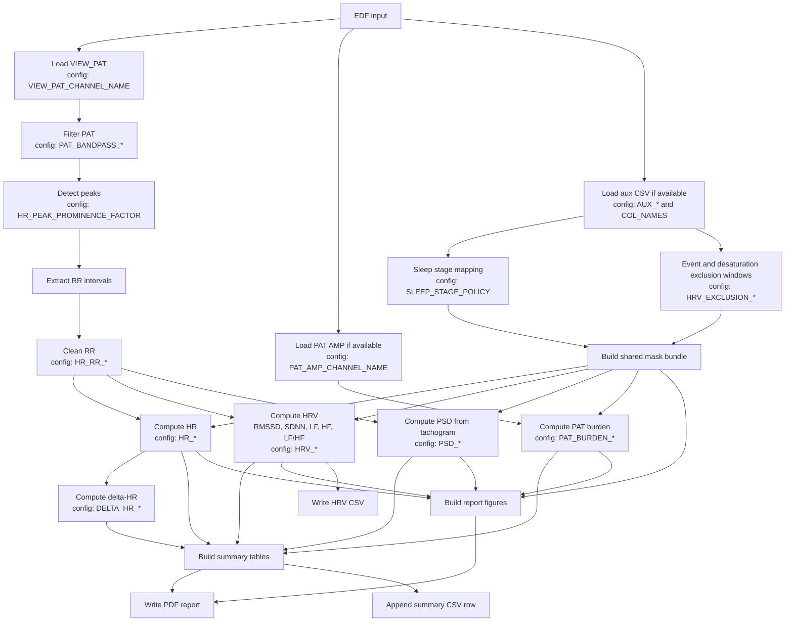

# PAT Toolbox

PAT Toolbox is a config-driven Python pipeline for processing EDF recordings with PAT-derived physiology signals, synchronized auxiliary sleep/event CSVs, and report-style outputs.

It is designed for whole-night batch processing of recordings that contain `VIEW_PAT` and optional derived channels such as PAT amplitude and actigraphy. The pipeline computes PAT-derived HR, HRV, PSD features, PAT burden, and multi-page PDF reports.

## What The Project Does

- Reads PAT-centered EDF recordings.
- Extracts and cleans RR intervals from PAT peaks.
- Computes PAT-derived HR on a regular time grid.
- Computes HRV metrics including RMSSD, SDNN, LF, HF, LF/HF, and time-varying HRV series.
- Applies shared sleep-stage, event, and desaturation masking across metrics and plots.
- Computes PSD summaries from an RR/tachogram representation.
- Optionally computes PAT burden from PAT amplitude around masked event regions.
- Produces summary CSV outputs and multi-page PDF reports.

## High-Level Pipeline

The main batch entry point is `main.py`.

For each EDF file, the current processing path is:

1. Load `VIEW_PAT`
2. Band-pass filter PAT
3. Load PAT amplitude if available
4. Load and normalize synchronized auxiliary CSV if available
5. Compute optional sleep-combination summaries
6. Compute PAT burden
7. Compute PAT-derived HR
8. Compute delta-HR
9. Compute HRV and HRV summary outputs
10. Build a multi-page report PDF
11. Optionally build a PAT peaks debug PDF
12. Append one summary CSV row for the recording

The public workflow entry remains `pat_toolbox/workflows.py`, but the implementation is now split into smaller load / metric / output step modules.

## Pipeline Diagram

The diagram below shows the main data flow through the current pipeline and highlights which config groups influence each stage.



In short: PAT drives the RR series, RR drives HR/HRV/PSD, aux data drives masking, and all of them come together in the final PDF and summary outputs.

## Repository Layout

```text
.
|- main.py
|- requirements.txt
|- AGENTS.md
|- analysis/
|  |- boxplots_AHI.py
|  `- boxplots_AHI_groups.py
|- experiments/
|  `- hypnogram_diego.py
`- pat_toolbox/
   |- __init__.py
   |- config.py
   |- context.py
   |- filters.py
   |- io_edf.py
   |- io_aux_csv.py
   |- masking.py
   |- paths.py
   |- sleep_mask.py
   |- workflows.py
   |- workflow_steps_load.py
   |- workflow_steps_metrics.py
   |- workflow_steps_output.py
   |- core/
   |  |- __init__.py
   |  |- rr_cleaning.py
   |  `- windows.py
   |- io/
   |  |- __init__.py
   |  |- aux_events.py
   |  |- aux_normalize.py
   |  `- aux_reader.py
   |- metrics/
   |  |- __init__.py
   |  |- hr.py
   |  |- hr_compute.py
   |  |- hr_debug.py
   |  |- hr_delta.py
   |  |- hr_io.py
   |  |- hr_summary.py
   |  |- hrv.py
   |  |- hrv_frequency_domain.py
   |  |- hrv_io.py
   |  |- hrv_pipeline.py
   |  |- hrv_time_domain.py
   |  |- pat_burden.py
   |  |- psd.py
   |  |- psd_pipeline.py
   |  `- spectral_utils.py
   `- plotting/
      |- __init__.py
      |- figures_hrv.py
      |- figures_summary.py
      |- hrv_plot_builders.py
      |- hrv_plot_utils.py
      |- peaks_debug.py
      |- report.py
      |- report_helpers.py
      |- segment_plot_helpers.py
      |- segments.py
      |- specs.py
      |- summary_hypnogram.py
      |- summary_table_helpers.py
      `- utils.py
```

## Architecture Overview

### `main.py`

- Lists EDF files from `config.EDF_FOLDER`
- Prints startup information
- Runs the per-recording workflow
- Keeps batch execution resilient so one bad file does not kill the whole run

### `pat_toolbox/workflows.py`

- Thin orchestration layer for one recording
- Creates a `RecordingContext`
- Calls the step modules in order

### `pat_toolbox/context.py`

- Defines `RecordingContext`, the per-recording state container
- Holds loaded signals, derived metrics, masks, summaries, and output paths

### `pat_toolbox/workflow_steps_load.py`

- PAT loading
- PAT filtering
- PAT amplitude loading
- aux CSV loading and normalization handoff

### `pat_toolbox/workflow_steps_metrics.py`

- HR computation
- delta-HR computation
- HRV computation
- PAT burden computation
- fixed sleep-subset summaries

### `pat_toolbox/workflow_steps_output.py`

- Main report PDF generation
- Peaks debug PDF generation
- Summary CSV append

## Core Modules

### Shared low-level logic

- `pat_toolbox/core/rr_cleaning.py`
  - PAT peak detection
  - RR extraction and RR cleaning
- `pat_toolbox/core/windows.py`
  - gap-aware interpolation helpers
  - contiguous run helpers
  - window acceptance helpers

### EDF and aux I/O

- `pat_toolbox/io_edf.py`
  - lists EDF files
  - reads EDF channels
- `pat_toolbox/io/aux_reader.py`
  - finds and reads per-recording aux CSV files
- `pat_toolbox/io/aux_normalize.py`
  - standardizes aux CSV structure and time fields
- `pat_toolbox/io/aux_events.py`
  - event masks, desaturation windows, time exclusion masks
- `pat_toolbox/io_aux_csv.py`
  - compatibility wrapper over the split aux modules

### Shared masking

- `pat_toolbox/masking.py`
  - central sleep/event/desaturation masking logic
  - builds reusable mask bundles for aligned time bases
- `pat_toolbox/sleep_mask.py`
  - sleep-stage mapping helpers and policy-related masking support

## Metrics Overview

### HR

Public facade:

- `pat_toolbox/metrics/hr.py`

Internal split:

- `pat_toolbox/metrics/hr_compute.py`
  - PAT peak to RR to HR computation
- `pat_toolbox/metrics/hr_io.py`
  - per-EDF HR wrapper and CSV save path
- `pat_toolbox/metrics/hr_debug.py`
  - debug PDF generation with peak overlays
- `pat_toolbox/metrics/hr_summary.py`
  - summary CSV append helpers

### HRV

Public facade:

- `pat_toolbox/metrics/hrv.py`

Internal split:

- `pat_toolbox/metrics/hrv_time_domain.py`
  - RMSSD / SDNN helpers and RMSSD series logic
- `pat_toolbox/metrics/hrv_frequency_domain.py`
  - LF / HF / LF-HF spectral computations from RR
- `pat_toolbox/metrics/hrv_pipeline.py`
  - top-level HRV orchestration and summaries
- `pat_toolbox/metrics/hrv_io.py`
  - HRV CSV export

### PSD

Public facade:

- `pat_toolbox/metrics/psd.py`

Internal split:

- `pat_toolbox/metrics/psd_pipeline.py`
  - PSD feature extraction and figure generation
- `pat_toolbox/metrics/spectral_utils.py`
  - shared Welch/tachogram spectral helpers

### Other metrics

- `pat_toolbox/metrics/hr_delta.py`
  - delta-HR series generation
- `pat_toolbox/metrics/pat_burden.py`
  - PAT burden metric from PAT amplitude in event/desaturation regions

## Plotting And Reporting Overview

Public plotting entry points:

- `pat_toolbox/plotting/report.py`
- `pat_toolbox/plotting/peaks_debug.py`

### Report assembly

- `pat_toolbox/plotting/report.py`
  - public report entry used by workflows
- `pat_toolbox/plotting/report_helpers.py`
  - report setup, figure selection, PDF writing

### HRV report figures

- `pat_toolbox/plotting/figures_hrv.py`
  - compatibility facade
- `pat_toolbox/plotting/hrv_plot_builders.py`
  - HRV overview and stagegram/TV figure builders
- `pat_toolbox/plotting/hrv_plot_utils.py`
  - legends, event overlays, mask shading, binning helpers

### Summary pages

- `pat_toolbox/plotting/figures_summary.py`
  - compatibility facade
- `pat_toolbox/plotting/summary_table_helpers.py`
  - summary-table pages and formatting helpers
- `pat_toolbox/plotting/summary_hypnogram.py`
  - stand-alone hypnogram page

### Segment pages

- `pat_toolbox/plotting/segments.py`
  - segment page assembly
- `pat_toolbox/plotting/segment_plot_helpers.py`
  - HR, HRV, delta-HR, and event overlay helpers

### Plotting utilities

- `pat_toolbox/plotting/specs.py`
  - event styling and active plot spec helpers
- `pat_toolbox/plotting/utils.py`
  - shared plotting utilities

## Inputs

### Required EDF content

The pipeline expects the main PAT channel configured as:

- `VIEW_PAT`

### Optional EDF channels

When present, these may be used in selected metrics or reports:

- `DERIVED_HR`
- `DERIVED_PAT_AMP`
- `ACTIGRAPH`

Channel names are configurable in `pat_toolbox/config.py`.

### Auxiliary CSV content

When a synchronized aux CSV exists, it may provide:

- sleep stages
- SpO2 / desaturation flags
- exclusion flags
- event annotations such as central / obstructive / unclassified A/H labels

The code normalizes aux fields using `config.COL_NAMES` and related aux settings.

## Shared Masking Model

The repository uses a shared masking approach so that HRV, PSD, burden, and plots refer to the same basic exclusion logic.

Conceptually, masking combines:

- sleep-stage inclusion policy
- event exclusion columns
- optional desaturation-based windows

The main outputs are aligned boolean masks such as:

- sleep-only keep mask
- event keep mask
- combined keep mask

This improves consistency between the values reported in summary tables and the data shown in the PDF figures.

## Configuration Philosophy

The project is deliberately config-driven.

The main control surface is:

- `pat_toolbox/config.py`

The first place to edit is now the top-level `FEATURES` block in `pat_toolbox/config.py`.

Use it to decide what the run should actually include before touching detailed thresholds.

Example:

```python
FEATURES = {
    "hr": True,
    "hrv": True,
    "psd": True,
    "delta_hr": False,
    "pat_burden": False,
    "sleep_combo_summary": False,
    "report_pdf": True,
    "peaks_debug_pdf": False,
}
```

What these top-level switches mean:

- `hr`
  - enables PAT-derived heart-rate calculation and HR-owned summary outputs
- `hrv`
  - enables HRV calculation, HRV report figures, and HRV CSV export
- `psd`
  - enables spectral feature calculation and PSD report pages
- `delta_hr`
  - enables event-response HR summaries and event-response HR plots on the original HR signal
- `pat_burden`
  - enables PAT amplitude loading, burden calculation, burden plotting, and burden summary outputs
- `sleep_combo_summary`
  - enables extra fixed sleep-subset comparison summaries
- `report_pdf`
  - enables the main multi-page report PDF
- `peaks_debug_pdf`
  - enables the separate PAT peaks debug PDF

Recommended workflow for users:

1. decide which features should be on in `FEATURES`
2. run the pipeline once
3. only then tune detailed knobs like `HR_*`, `HRV_*`, `PSD_*`, or `PAT_BURDEN_*`

Common configuration areas include:

- paths and run labeling
- sleep-stage inclusion policy
- channel names and aux column mapping
- exclusion window logic
- PAT filtering
- HR thresholds and smoothing
- RR cleaning thresholds
- HRV windows and spectral settings
- PSD band definitions
- delta-HR settings
- PAT burden settings
- report layout / debugging options

Most experiments should be done by editing config values rather than modifying metric code.

## Setup

Create and activate a virtual environment, then install dependencies:

```bash
python -m venv .venv
source .venv/bin/activate
pip install -r requirements.txt
```

## Main Dependencies

The project relies mainly on:

- `numpy`
- `scipy`
- `pandas`
- `matplotlib`
- `mne`
- `pyEDFlib`
- `tqdm`

Additional analysis/plotting packages are pinned in `requirements.txt`.

## How To Run

### Full pipeline

```bash
python main.py
```

This is the standard batch workflow and uses the current values in `pat_toolbox/config.py`.

### Stand-alone scripts

```bash
python analysis/boxplots_AHI.py
python analysis/boxplots_AHI_groups.py
python experiments/hypnogram_diego.py
```

Run everything from the repository root.

## Outputs

Typical outputs include:

- per-run PDF reports
- HR CSV outputs
- HRV CSV outputs
- PSD figures
- optional PAT peak debug PDFs
- appended summary CSV rows

Output folder names include a run-specific suffix derived from:

- `RUN_ID`
- sleep-stage policy
- `RUN_TAG`

## Validation

There is currently no automated in-repo test suite.

For a safe syntax check, run:

```bash
python -m compileall main.py pat_toolbox analysis experiments
```

If local data paths are valid, the most important real smoke test is:

```bash
python main.py
```

## Troubleshooting

- No EDF files found
  - check `config.EDF_FOLDER`
- Output paths look wrong
  - check `BASE_OUTPUT_DIR`, `RUN_TAG`, and sleep-stage policy
- HR/HRV outputs are sparse or empty
  - inspect PAT quality, RR cleaning, masking policy, and exclusion windows
- PSD features are missing
  - the RR series may be too fragmented after masking
- aux overlays are missing
  - inspect aux CSV naming, time parsing, and `COL_NAMES`
- report content differs from expectation
  - verify sleep policy, active exclusion columns, and plotting toggles in `config.py`

## Development Notes

- The repository is plain Python, not a packaged project.
- Absolute paths in `pat_toolbox/config.py` are machine-specific by design.
- The current codebase has already been refactored into smaller metric, plotting, and workflow modules while keeping stable public entry points.
- `AGENTS.md` contains agent-facing repository guidance and validation expectations.

## Current Entry Points To Know

- Batch run: `main.py`
- Single-recording workflow: `pat_toolbox/workflows.py`
- Main report generation: `pat_toolbox/plotting/report.py`
- HR facade: `pat_toolbox/metrics/hr.py`
- HRV facade: `pat_toolbox/metrics/hrv.py`
- PSD facade: `pat_toolbox/metrics/psd.py`
- Main configuration: `pat_toolbox/config.py`
