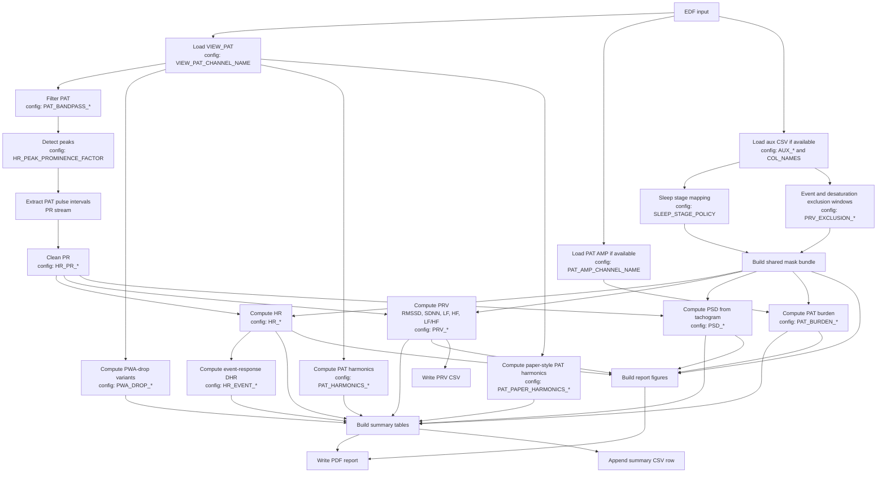

# PAT Toolbox

PAT Toolbox is a config-driven Python pipeline for processing whole-night EDF recordings with PAT-derived physiology signals, synchronized auxiliary sleep/event CSVs, and report-style outputs.

It is designed for recordings that contain `VIEW_PAT` and, when available, optional derived channels such as PAT amplitude, SpO2, and actigraphy. The pipeline computes PAT-derived heart rate (HR), pulse rate variability (PRV), event-response DHR, optional PSD, PAT burden, PWA-drop summaries, PAT harmonic summaries, and multi-page PDF reports.

Physiologically, the repository starts from the peripheral arterial tone waveform and treats it as a pulsatile vascular signal. Detected PAT pulse peaks are converted into pulse-to-pulse intervals, and those intervals are then used to derive HR, PRV, and tachogram-based spectral summaries. In other words, the main derived quantities are vascular pulse-based rather than ECG-based.

## Terminology

In this repository:

- `PAT` means Peripheral Arterial Tone.
- `PR` means a PAT-derived pulse-to-pulse interval (PRI) between adjacent detected PAT peaks.
- `PRV` means pulse rate variability derived from those PAT pulse intervals.

This repository does not treat the PAT-derived interval stream as ECG `R-R` intervals. The `PR` abbreviation here is repository shorthand for PAT pulse intervals (more precisely, a PAT-derived pulse interval or PRI), not the ECG PR interval.

## Signal Interpretation

For a first-time reader, it is helpful to think of the pipeline in three layers:

1. `PAT waveform`
   - the original pulsatile peripheral vascular signal recorded in the EDF
2. `PR interval stream`
   - the sequence of pulse-to-pulse intervals obtained from adjacent PAT peaks
3. `derived summaries`
   - HR, PRV, spectral PRV measures, and optional burden/event-response summaries

This means that the report pages and CSV outputs are not abstract signal-processing products only. They are intended to describe how vascular pulse timing and amplitude vary across the night and across different sleep or event conditions.

## Start Here

If you are opening this repository for the first time, the shortest practical path is:

1. Edit the dataset and output paths in `pat_toolbox/config.py`.
2. Decide which outputs you want in the top-level `FEATURES` block.
3. Run `python main.py` from the repository root.
4. Check the generated PDF report, PRV/HR CSV files, and summary CSV output.

The rest of this README explains what the pipeline computes, how the codebase is organized, and which config groups control the main steps.

## What The Project Does

- Reads PAT-centered EDF recordings.
- Extracts and cleans PAT pulse intervals (`PR`) from adjacent PAT peaks.
- Computes PAT-derived HR on a regular time grid.
- Computes PRV metrics including RMSSD, SDNN, LF, HF, LF/HF, and time-varying PRV series.
- Applies shared sleep-stage, event, and desaturation masking across metrics and plots.
- Computes event-response DHR summaries around respiratory-event regions.
- Computes PSD summaries from a PR tachogram representation.
- Optionally computes PAT burden from PAT amplitude around masked event regions.
- Optionally computes discrete 30% and 50% PWA-drop event variants from waveform-derived pulse-wave amplitude.
- Optionally computes raw Welch PAT harmonics and beat-synchronous paper-style PAT harmonic coefficients from the full `VIEW_PAT` signal.
- Optionally loads actigraphy for visual segment-level motion sanity checks.
- Produces summary CSV outputs and multi-page PDF reports.

In practical terms, the toolbox answers questions such as:

- how stable or variable is pulse timing during different parts of sleep?
- how do respiratory events and quality exclusions change the usable physiology?
- how do time-domain and frequency-domain PRV summaries differ across the night?
- which short segments provide clean examples of PAT pulse detection and downstream PRV estimation?

## High-Level Pipeline

The main batch entry point is `main.py`.

For each EDF file, the current processing path is:

1. Load `VIEW_PAT`
2. Band-pass filter PAT
3. Load PAT amplitude if available
4. Optionally load SpO2 for validation plots
5. Load and normalize synchronized auxiliary CSV if available
6. Compute optional sleep-combination summaries
7. Compute PAT burden
8. Compute PWA-drop variants
9. Compute PAT harmonic summaries
10. Compute paper-style beat-synchronous PAT harmonic summaries
11. Compute PAT-derived HR
12. Compute event-response DHR
13. Compute PRV and PRV summary outputs
14. Compute optional standalone PSD features
15. Export per-feature CSV files
16. Build a multi-page report PDF
17. Optionally build a PAT peaks debug PDF
18. Optionally export a publication-style PRV PNG
19. Append one summary CSV row for the recording

The public workflow entry remains `pat_toolbox/workflows.py`, but the implementation is now split into smaller load / metric / output step modules.

From a physiology point of view, the key transition is:

- PAT waveform -> PAT peaks -> PR intervals -> HR / PRV / spectral summaries

The auxiliary CSV then decides which parts of the night are considered biologically relevant for the selected analysis, for example by restricting the analysis to chosen sleep stages or excluding event-contaminated intervals.

## Pipeline Diagram

The diagram below shows the main data flow through the current pipeline and highlights which config groups influence each stage.



In short: PAT drives the PR series, PR drives HR/PRV/PSD, aux data drives masking, and all of them come together in the final PDF and summary outputs.

## Repository Layout

```text
.
|- main.py
|- requirements.txt
|- AGENTS.md
|- analysis/
|  |- boxplots_AHI.py
|  `- boxplots_AHI_groups.py
|- experiments/
|  `- hypnogram_diego.py
`- pat_toolbox/
   |- __init__.py
   |- config.py
   |- context.py
   |- filters.py
   |- io_edf.py
   |- io_aux_csv.py
   |- masking.py
   |- paths.py
   |- sleep_mask.py
   |- workflows.py
   |- workflow_steps_load.py
   |- workflow_steps_metrics.py
   |- workflow_steps_output.py
   |- core/
   |  |- __init__.py
   |  |- pr_cleaning.py
   |  `- windows.py
   |- io/
   |  |- __init__.py
   |  |- aux_events.py
   |  |- aux_normalize.py
   |  `- aux_reader.py
    |- metrics/
   |  |- __init__.py
   |  |- hr.py
   |  |- hr_compute.py
   |  |- hr_debug.py
   |  |- hr_event_response.py
   |  |- hr_io.py
   |  |- hr_summary.py
   |  |- prv.py
   |  |- prv_frequency_domain.py
   |  |- prv_io.py
   |  |- prv_pipeline.py
   |  |- prv_time_domain.py
    |  |- pat_burden.py
    |  |- pat_burden_io.py
    |  |- pat_harmonics.py
    |  |- pat_harmonics_io.py
    |  |- pat_paper_harmonics.py
    |  |- pat_paper_harmonics_io.py
    |  |- pwa_drop.py
   |  |- pwa_drop_io.py
   |  |- psd.py
   |  |- psd_pipeline.py
   |  `- spectral_utils.py
   `- plotting/
      |- __init__.py
      |- figures_prv.py
      |- figures_summary.py
      |- feature_overview_builders.py
      |- prv_plot_builders.py
      |- prv_plot_utils.py
      |- peaks_debug.py
      |- report.py
      |- report_helpers.py
      |- segment_plot_helpers.py
      |- segments.py
      |- specs.py
      |- summary_hypnogram.py
      |- summary_table_helpers.py
      `- utils.py
```

## Architecture Overview

### `main.py`

- Lists EDF files from `config.EDF_FOLDER`
- Prints startup information
- Runs the per-recording workflow
- Keeps batch execution resilient so one failed file does not stop the full batch run

### `pat_toolbox/workflows.py`

- Thin orchestration layer for one recording
- Creates a `RecordingContext`
- Calls the step modules in order

### `pat_toolbox/context.py`

- Defines `RecordingContext`, the per-recording state container
- Holds loaded signals, derived metrics, masks, summaries, and output paths

### `pat_toolbox/workflow_steps_load.py`

- PAT loading
- PAT filtering
- PAT amplitude loading
- aux CSV loading and normalization handoff

### `pat_toolbox/workflow_steps_metrics.py`

- HR computation
- event-response DHR computation
- PRV computation
- PAT burden computation
- PWA-drop computation
- fixed sleep-subset summaries

### `pat_toolbox/workflow_steps_output.py`

- Main report PDF generation
- Peaks debug PDF generation
- Per-feature CSV export
- publication-style PRV PNG export
- Summary CSV append

## Core Modules

### Shared low-level logic

- `pat_toolbox/core/pr_cleaning.py`
  - PAT peak detection
  - PR extraction and PR cleaning
- `pat_toolbox/core/windows.py`
  - gap-aware interpolation helpers
  - contiguous run helpers
  - window acceptance helpers

### EDF and aux I/O

- `pat_toolbox/io_edf.py`
  - lists EDF files
  - reads EDF channels
- `pat_toolbox/io/aux_reader.py`
  - finds and reads per-recording aux CSV files
- `pat_toolbox/io/aux_normalize.py`
  - standardizes aux CSV structure and time fields
- `pat_toolbox/io/aux_events.py`
  - event masks, desaturation windows, time exclusion masks
- `pat_toolbox/io_aux_csv.py`
  - compatibility wrapper over the split aux modules

### Shared masking

- `pat_toolbox/masking.py`
  - central sleep/event/desaturation masking logic
  - builds reusable mask bundles for aligned time bases
- `pat_toolbox/sleep_mask.py`
  - sleep-stage mapping helpers and policy-related masking support

## Metrics Overview

### HR

Public facade:

- `pat_toolbox/metrics/hr.py`

Internal split:

- `pat_toolbox/metrics/hr_compute.py`
  - PAT peak to PR to HR computation
- `pat_toolbox/metrics/hr_io.py`
  - per-EDF HR wrapper and CSV save path
- `pat_toolbox/metrics/hr_debug.py`
  - debug PDF generation with peak overlays
- `pat_toolbox/metrics/hr_summary.py`
  - summary CSV append helpers
- `pat_toolbox/metrics/hr_event_response.py`
  - event-response HR window extraction, summaries, and CSV export

### PRV

Public facade:

- `pat_toolbox/metrics/prv.py`

Internal split:

- `pat_toolbox/metrics/prv_time_domain.py`
  - RMSSD / SDNN helpers and RMSSD series logic
- `pat_toolbox/metrics/prv_frequency_domain.py`
  - LF / HF / LF-HF spectral computations from PR
- `pat_toolbox/metrics/prv_pipeline.py`
  - top-level PRV orchestration and summaries
- `pat_toolbox/metrics/prv_io.py`
  - PRV CSV export

### PSD

Public facade:

- `pat_toolbox/metrics/psd.py`

Internal split:

- `pat_toolbox/metrics/psd_pipeline.py`
  - PSD feature extraction and figure generation
- `pat_toolbox/metrics/spectral_utils.py`
  - shared Welch/tachogram spectral helpers

### Other metrics

- `pat_toolbox/metrics/pat_burden.py`
  - PAT burden metric from PAT amplitude in event/desaturation regions
- `pat_toolbox/metrics/pat_burden_io.py`
  - PAT burden episode and summary CSV export
- `pat_toolbox/metrics/pwa_drop.py`
  - discrete PWA-drop detection from PAT-derived pulse-wave amplitude
- `pat_toolbox/metrics/pwa_drop_io.py`
  - threshold-variant PWA-drop event and summary CSV export
- `pat_toolbox/metrics/pat_harmonics.py`
  - raw Welch harmonic summaries from the full `VIEW_PAT` waveform by default
- `pat_toolbox/metrics/pat_harmonics_io.py`
  - raw PAT harmonics window and summary CSV export
- `pat_toolbox/metrics/pat_paper_harmonics.py`
  - beat-synchronous C0-C10 pulse-shape harmonic coefficients, normalized Cn/C0 coefficients, high-order harmonic ratio, subharmonic powers, and sleep-stage-at-window-center summaries
- `pat_toolbox/metrics/pat_paper_harmonics_io.py`
  - paper-style PAT harmonics window and summary CSV export

## Plotting And Reporting Overview

Public plotting entry points:

- `pat_toolbox/plotting/report.py`
- `pat_toolbox/plotting/peaks_debug.py`
- `pat_toolbox/plotting/publication_prv.py`

### Report assembly

- `pat_toolbox/plotting/report.py`
  - public report entry used by workflows
- `pat_toolbox/plotting/report_helpers.py`
  - report setup, figure selection, PDF writing, and report page ordering

The current PDF order is designed to surface overnight context before dense segment pages:

1. front page
2. hypnogram / stage overview
3. overnight overview pages, with harmonics shown early
4. PSD pages when enabled
5. summary table pages
6. detailed segment pages

### PRV report figures

- `pat_toolbox/plotting/figures_prv.py`
  - compatibility facade
- `pat_toolbox/plotting/prv_plot_builders.py`
  - PRV overview and stagegram/TV figure builders
- `pat_toolbox/plotting/prv_plot_utils.py`
  - legends, event overlays, mask shading, binning helpers

### Publication figure export

- `pat_toolbox/plotting/publication_prv.py`
  - high-resolution single-recording publication PNG export for an automatically selected NREM segment

### Summary pages

- `pat_toolbox/plotting/figures_summary.py`
  - compatibility facade
- `pat_toolbox/plotting/summary_table_helpers.py`
  - summary-table pages, split sleep-subset comparison tables, and formatting helpers

Wide sleep-subset comparison tables are split across multiple pages when needed so headers and explanatory notes remain readable.
- `pat_toolbox/plotting/summary_hypnogram.py`
  - stand-alone hypnogram page

### Segment pages

- `pat_toolbox/plotting/segments.py`
  - segment page assembly
- `pat_toolbox/plotting/segment_plot_helpers.py`
  - HR, PRV, DHR, PAT amplitude, PWA, actigraphy, and event overlay helpers

### Plotting utilities

- `pat_toolbox/plotting/specs.py`
  - event styling and active plot spec helpers
- `pat_toolbox/plotting/utils.py`
  - shared plotting utilities

## Inputs

### Required EDF content

The pipeline expects the main PAT channel configured as:

- `VIEW_PAT`

### Optional EDF channels

When present, these may be used in selected metrics or reports:

- `DERIVED_HR`
- `DERIVED_PAT_AMP`
- `ACTIGRAPH`
- SpO2 channels matching `SPO2_CHANNEL_CANDIDATES`, when SpO2 validation plots are enabled

Channel names are configurable in `pat_toolbox/config.py`.

### Auxiliary CSV content

When a synchronized aux CSV exists, it may provide:

- sleep stages
- SpO2 / desaturation flags
- exclusion flags
- event annotations such as central / obstructive / unclassified A/H labels

The code normalizes aux fields using `config.COL_NAMES` and related aux settings.

## Shared Masking Model

The repository uses a shared masking approach so that PRV, PSD, burden, and plots refer to the same basic exclusion logic.

Conceptually, masking combines:

- sleep-stage inclusion policy
- event exclusion columns
- optional desaturation-based windows

The main outputs are aligned boolean masks such as:

- sleep-only keep mask
- event keep mask
- combined keep mask

This improves consistency between the values reported in summary tables and the data shown in the PDF figures.

Exception: the PAT harmonic feature families use the full raw `VIEW_PAT` signal by default. Event/desaturation/sleep-stage masks are not applied to harmonic calculation unless `PAT_HARMONICS_USE_MASK` or `PAT_PAPER_HARMONICS_USE_MASK` is explicitly enabled. Paper-style harmonic windows are still assigned sleep-stage labels afterward for per-stage summaries.

## Event-Response DHR

`delta_hr` is the repository's event-response DHR feature. It asks how strongly PAT-derived HR increases from an event-window minimum to a post-event maximum around excluded respiratory-event regions rather than summarizing HR variability across the whole night.

### What it does

For each detected excluded event run:

1. Build an event window starting at the excluded-run onset.
2. Use a fixed event duration from `HR_EVENT_WINDOW_SEC`.
3. Optionally extend the event window to the end of any overlapping gated desaturation window when `HR_EVENT_USE_DESAT_EXTENSION = True`.
4. Build a subject/recording-specific post-event DHR search window from the ensemble-average event response when enough events are available.
5. Fall back to the fixed post-event search window `[HR_EVENT_WINDOW_SEC, HR_EVENT_RECOVERY_END_SEC]` when the ensemble response cannot define a stable search window.
6. Smooth HR first using `HR_EVENT_SMOOTH_SEC`.
7. Require at least `HR_EVENT_MIN_SAMPLES` valid HR samples in both the event and post-event search windows.

For each accepted event, the code extracts:

- event-window minimum HR
- post-event search-window maximum HR
- DHR = `post-event maximum HR - event-window minimum HR`

### How to interpret it

Physiologically, this feature is meant to describe autonomic / cardio-vascular responsiveness around respiratory-event-related stress periods.

- Higher `DHR` means a larger event-centered HR rebound from the event-window trough to the post-event peak.
- A larger number of usable windows means the estimate is based on more valid events rather than on isolated examples.

This is an event-centered response metric, not a whole-night HR variability metric.

### Outputs

When `FEATURES["delta_hr"] = True`, the pipeline now produces:

- selected-policy summary metrics in the main summary CSV
- event-response rows in report summary pages
- an event-response overview page in the PDF
- a DHR subplot on segment pages
- an event-level CSV export in `EVENT_HR__.../<edf>__Event_HR_Windows.csv`

## PAT Burden

`pat_burden` quantifies cumulative PAT amplitude suppression during excluded event/desaturation periods inside the selected sleep policy.

### What it does

The burden logic uses the PAT amplitude channel `DERIVED_PAT_AMP`.

1. Restrict analysis to samples inside the selected sleep policy.
2. Mark burden episodes inside excluded event/desaturation regions.
3. Group contiguous excluded regions into burden episodes.
4. Skip episodes shorter than `PAT_BURDEN_MIN_EPISODE_SEC`.
5. For each remaining episode, estimate a local baseline from the preceding `PAT_BURDEN_BASELINE_LOOKBACK_SEC` using the `PAT_BURDEN_BASELINE_PCTL` percentile of valid baseline samples.
6. Compute the drop below baseline during the episode.
7. Integrate that drop over time.
8. Sum area across episodes and normalize by sleep hours.

If `PAT_BURDEN_RELATIVE = True`, the drop is normalized by the local baseline before integration.

### How to interpret it

Physiologically, PAT burden is intended to reflect how strongly peripheral pulse amplitude is attenuated during respiratory-event-related disturbed periods.

- Higher burden means larger and/or longer PAT amplitude suppression during event-linked intervals.
- Lower burden means smaller and/or shorter suppression.
- Because the metric is normalized by sleep hours, it is closer to a burden intensity per hour than a raw total-area measure.

This is not the same as event count or desaturation count. It is a cumulative depth-times-duration measure of PAT attenuation during those intervals.

### Outputs

When `FEATURES["pat_burden"] = True`, the pipeline now produces:

- summary fields in the main summary CSV
- a dedicated PAT burden summary page in the PDF
- a PAT burden overview page
- a PAT AMP segment subplot with burden shading
- an episode-level CSV export in `PATBurden__.../<edf>__PAT_Burden_Episodes.csv`
- a per-recording summary export in `PATBurden__.../<edf>__PAT_Burden_Summary.csv`

The burden diagnostics now also report items such as episode counts, skipped episode reasons, finite PAT AMP coverage, inside-event/desaturation minutes, and invalid PAT AMP minutes inside burden regions.

## PWA-Drop

`pwa_drop` is a discrete pulse-wave-amplitude drop detector derived from the PAT waveform itself. Unlike PAT burden, which summarizes cumulative amplitude suppression inside excluded event/desaturation regions, PWA-drop identifies individual drop events and characterizes their timing and morphology.

### What it does

The current implementation follows the logic style of the external MATLAB `PWA_drop` project:

1. Start from the filtered `VIEW_PAT` waveform used by the workflow.
2. Smooth and detrend the waveform.
3. Extract a beat-to-beat pulse-wave-amplitude (`PWA`) series from local maxima and minima.
4. Remove obvious artefactual or sensor-loss segments.
5. Build a baseline-stability mask from local variance.
6. Find candidate drops from local variance peaks paired with negative local derivative.
7. For each candidate, estimate a local baseline from preceding stable beats.
8. Re-express the local tract as percent change from baseline.
9. Keep the candidate only if it passes primary and secondary amplitude/depth criteria.
10. Save discrete event properties such as duration, amplitude, slopes, and area under the drop curve.

The feature runs two configured threshold variants from the same PAT-derived PWA signal:

- `30%` variant: primary threshold `30%`, secondary threshold `20%`
- `50%` variant: primary threshold `50%`, secondary threshold `40%`

Each variant is summarized independently within the selected sleep policy.

### How to interpret it

Physiologically, PWA-drop is intended to represent discrete transient reductions in pulse-wave amplitude, which may reflect short-lived vascular tone changes, autonomic activation, or respiratory-event-related peripheral vasoconstrictive responses.

- Higher drop count means more detected discrete PWA suppression events.
- Higher drop rate per sleep hour means these events occur more frequently during the analyzed sleep period.
- Higher mean amplitude means deeper drops relative to local baseline.
- Higher mean AUC means larger cumulative suppression per drop event.

This feature is event-detection oriented. It is different from PAT burden:

- `PAT burden` = cumulative burden inside excluded event/desaturation intervals
- `PWA-drop` = discrete detected PWA-drop events from the waveform-derived PWA series

### Outputs

When `FEATURES["pwa_drop"] = True`, the pipeline now produces:

- selected-policy summary metrics in the main summary CSV for both 30% and 50% variants
- sleep-subset comparison metrics for the fixed subset summaries
- summary-table rows in the PDF
- a full-night PWA-drop overview page
- a segment-level stem plot of PAT-derived PWA with 30% and 50% drop overlays
- event-level CSV exports such as `PWADrop__.../<edf>__PWA_Drop_30pct_Events.csv` and `PWADrop__.../<edf>__PWA_Drop_50pct_Events.csv`
- per-recording summary exports such as `PWADrop__.../<edf>__PWA_Drop_30pct_Summary.csv` and `PWADrop__.../<edf>__PWA_Drop_50pct_Summary.csv`

For `delta_hr`, `pat_burden`, and `pwa_drop`, the fixed sleep-subset policies are currently reported in summary/comparison form only. Detailed event/episode CSV exports are generated for the main selected-policy analysis, not as separate per-subset export files.

## PAT Harmonics

The toolbox includes two separate PAT harmonic feature families. Both use the raw `VIEW_PAT` signal by default and do not remove respiratory-event or desaturation regions from the harmonic calculation unless explicitly configured to do so.

### Raw Welch PAT harmonics

`pat_harmonics` computes fixed-window spectral summaries directly from the PAT waveform:

- window length: `120 s`
- hop: `60 s`
- fundamental search band: `0.5 to 2.5 Hz`
- harmonics: `H1` through `H5`

Outputs include per-window and per-recording summaries for the fundamental frequency, harmonic powers, harmonic ratios, total harmonic power, and a harmonic distortion index.

### Paper-style beat-synchronous PAT harmonics

`pat_paper_harmonics` computes beat-synchronous pulse-shape coefficients inspired by peripheral pulse harmonic analyses:

1. Detect PAT pulse peaks.
2. Segment pulse cycles between adjacent peaks.
3. Resample each pulse cycle to a common phase grid.
4. Compute FFT amplitudes `C0` through `C10` per pulse.
5. Normalize harmonic amplitudes as `C1/C0` through `C10/C0`.
6. Average valid pulse coefficients within each `120 s` window.

Additional outputs include:

- `hf_ratio = sum(C6/C0 ... C10/C0) / sum(C1/C0 ... C10/C0)`, a compact high-order harmonic-content index
- subharmonic VLF/LF/HF powers from the raw windowed PAT signal
- beat counts per harmonic window
- sleep-stage code and label assigned from the sleep stage at the harmonic window center
- per-stage wake/light/deep/REM summaries for C0, normalized coefficients, high-order ratio, and subharmonic powers

The PDF places overnight overview pages before the detailed segment pages, with harmonics shown early after the hypnogram/stage page. The paper-style C/C0 heatmap uses a horizontal colorbar above the heatmap so the heatmap time axis stays aligned with the other subplots. The normalized coefficient page uses robust y-limits with clipped outlier markers so the main trend is readable without hiding extreme values.

## Configuration Philosophy

The project is deliberately config-driven.

The main control surface is:

- `pat_toolbox/config.py`

The first place to edit is now the top-level `FEATURES` block in `pat_toolbox/config.py`.

Use it to decide what the run should actually include before touching detailed thresholds.

Example:

```python
FEATURES = {
    "hr": True,
    "prv": True,
    "psd": True,
    "delta_hr": False,
    "pat_burden": False,
    "pwa_drop": False,
    "pat_harmonics": False,
    "pat_paper_harmonics": False,
    "sleep_combo_summary": False,
    "report_pdf": True,
    "peaks_debug_pdf": False,
}
```

What these top-level switches mean:

- `hr`
  - enables PAT-derived heart-rate calculation and HR-owned summary outputs
- `prv`
  - enables PRV calculation, PRV report figures, and PRV CSV export
- `psd`
  - enables spectral feature calculation and PSD report pages
- `delta_hr`
  - enables event-response HR summaries and event-response HR plots on the original HR signal
- `pat_burden`
  - enables PAT amplitude loading, burden calculation, burden plotting, and burden summary outputs
- `pwa_drop`
  - enables waveform-derived pulse-wave-amplitude drop detection, summary outputs, plots, and CSV export
- `pat_harmonics`
  - enables raw Welch harmonic summaries from the full PAT waveform by default
- `pat_paper_harmonics`
  - enables beat-synchronous C0-C10 pulse-shape harmonic indices and stage-at-window-center summaries
- `sleep_combo_summary`
  - enables extra fixed sleep-subset comparison summaries
- `report_pdf`
  - enables the main multi-page report PDF
- `peaks_debug_pdf`
  - enables the separate PAT peaks debug PDF

Recommended workflow for users:

1. decide which features should be on in `FEATURES`
2. run the pipeline once
3. only then tune detailed knobs like `HR_*`, `PRV_*`, `PSD_*`, or `PAT_BURDEN_*`

Common configuration areas include:

- paths and run labeling
- sleep-stage inclusion policy
- channel names and aux column mapping
- exclusion window logic
- PAT filtering
- HR thresholds and smoothing
- PR cleaning thresholds
- PRV windows and spectral settings
- PSD band definitions
- event-response DHR settings
- PAT burden settings
- PWA-drop threshold variants
- raw and paper-style PAT harmonics settings
- report layout / debugging options

Most experiments should be done by editing config values rather than modifying metric code.

## Setup

Create and activate a virtual environment, then install dependencies:

```bash
python -m venv .venv
source .venv/bin/activate
pip install -r requirements.txt
```

## Main Dependencies

The project relies mainly on:

- `numpy`
- `scipy`
- `pandas`
- `matplotlib`
- `mne`
- `pyEDFlib`
- `tqdm`

Additional analysis/plotting packages are pinned in `requirements.txt`.

## How To Run

### Full pipeline

```bash
python main.py
```

This is the standard batch workflow and uses the current values in `pat_toolbox/config.py`.

In most cases, the only required edits before the first run are:

- `EDF_FOLDER`
- `BASE_OUTPUT_DIR`
- `FEATURES`
- sleep-stage policy and exclusion settings if you want a different analysis subset

### Stand-alone scripts

```bash
python analysis/boxplots_AHI.py
python analysis/boxplots_AHI_groups.py
python experiments/hypnogram_diego.py
```

Run everything from the repository root.

## Outputs

Typical outputs include:

- per-run PDF reports
- HR CSV outputs
- PRV CSV outputs
- PRV mask CSV outputs
- event-response HR window CSV outputs
- PAT burden episode and summary CSV outputs
- PWA-drop event and summary CSV outputs
- PAT harmonics window and summary CSV outputs
- paper-style PAT harmonics window and summary CSV outputs
- sleep timing CSV outputs
- PSD figures
- optional PAT peak debug PDFs
- optional publication-style PRV PNG figures
- appended summary CSV rows

Output folder names include a run-specific suffix derived from:

- `RUN_ID`
- sleep-stage policy
- `RUN_TAG`

## Validation

There is currently no automated in-repo test suite.

For a safe syntax check, run:

```bash
python -m compileall main.py pat_toolbox analysis experiments
```

If local data paths are valid, the most important real smoke test is:

```bash
python main.py
```

## Troubleshooting

- No EDF files found
  - check `config.EDF_FOLDER`
- Output paths look wrong
  - check `BASE_OUTPUT_DIR`, `RUN_TAG`, and sleep-stage policy
- HR/PRV outputs are sparse or empty
  - inspect PAT quality, PR cleaning, masking policy, and exclusion windows
- PSD features are missing
  - the PR series may be too fragmented after masking
- aux overlays are missing
  - inspect aux CSV naming, time parsing, and `COL_NAMES`
- report content differs from expectation
  - verify sleep policy, active exclusion columns, and plotting toggles in `config.py`

## Development Notes

- The repository is plain Python, not a packaged project.
- Absolute paths in `pat_toolbox/config.py` are machine-specific by design.
- The current codebase has already been refactored into smaller metric, plotting, and workflow modules while keeping stable public entry points.
- `AGENTS.md` contains agent-facing repository guidance and validation expectations.

## Current Entry Points To Know

- Batch run: `main.py`
- Single-recording workflow: `pat_toolbox/workflows.py`
- Main report generation: `pat_toolbox/plotting/report.py`
- HR facade: `pat_toolbox/metrics/hr.py`
- PRV facade: `pat_toolbox/metrics/prv.py`
- PSD facade: `pat_toolbox/metrics/psd.py`
- Main configuration: `pat_toolbox/config.py`
